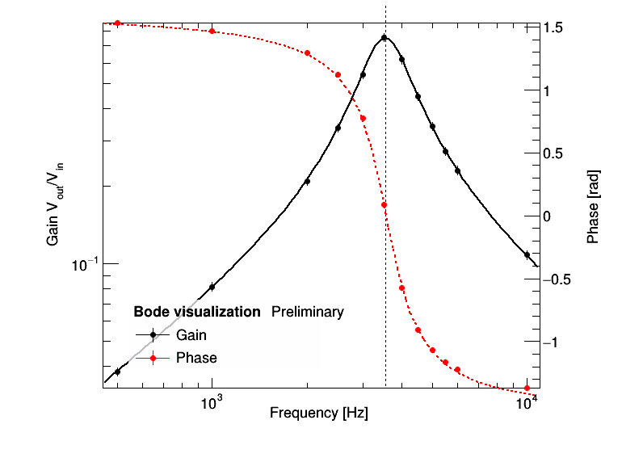

# Bode Diagrams
Bode diagrams visualization


## `Bode` class

Declared in header file Bode/Analysis.h.

### Usage

Given a input file (`input.txt` in the example below) in the format 

```
V_in   V_in(full-scale)   V_out   V_out(full-scale)   T   T(full-scale)   dt   dt(full-scale)
```

it produces the following image output



from the following commands

```cpp
#include<Bode/Analysis.h>

Bode test("bandpass", "input.txt");

test.SetParGain(1, 3e3, 10); // fit parameters for gain plot
test.SetParPhase(2, 3e3);    // fit parameters for phase plot

test.FitGain();
test.FitPhase();

test.Plot();
```

## `SimEngine` class

Declared in header file BodeDataSim/SimEngine.h
